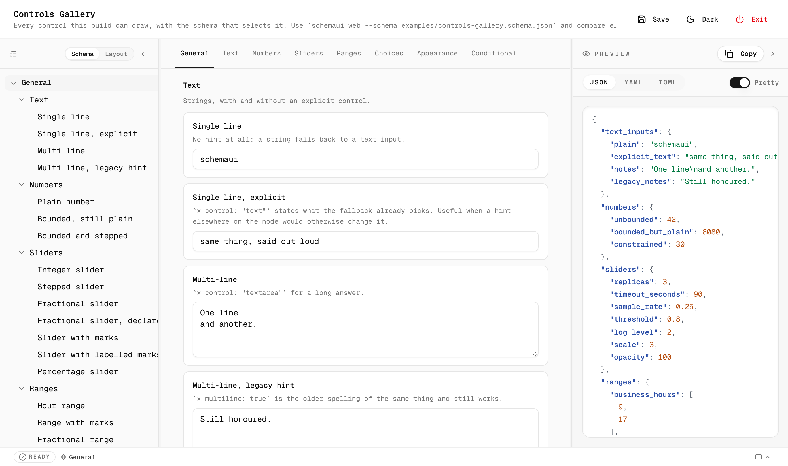
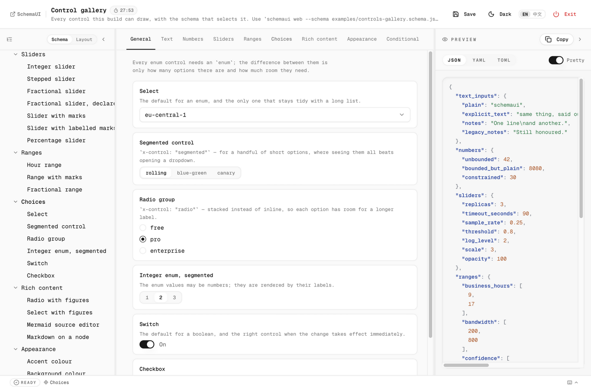
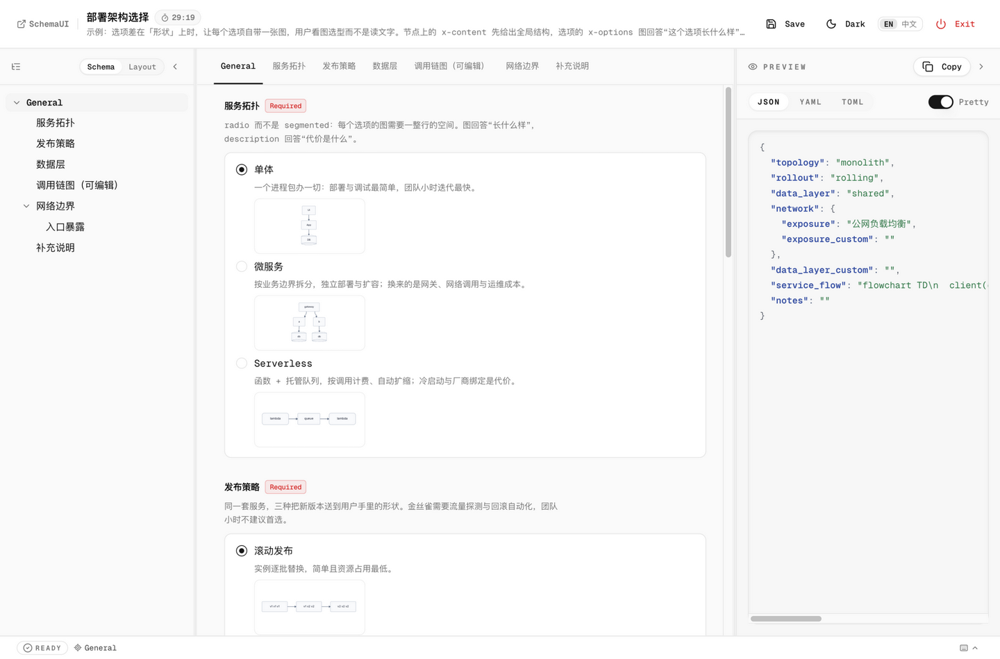
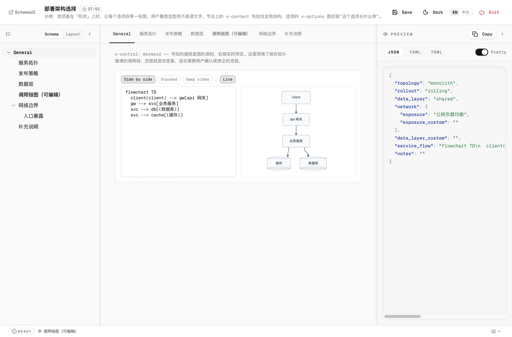

# a2ui-ask

> **Interactive UI for AI agents — turn structured questions into browser
> forms.**

Give your AI agent a real UI. When Claude Code, Codex, Cursor, or any other
agent needs you to pick options or fill in structured config, `a2ui-ask` pops
open a **real browser form** — with validation, defaults, and multi-select —
instead of a wall of chat text. Your answers land in a versioned JSON file both
you and the agent can re-read later.

[English](./README.md) | [中文文档](./README.ZH.md)



Every control the engine can draw — sliders, range sliders with marks, segmented
controls, radio groups, switches, a custom color picker, conditional fields —
driven entirely by schema hints, and the skill tells the agent to reach for
them. Figures ride the same hints: a question or an option can carry a **Mermaid
diagram, an inline SVG, or sanitised Markdown** (`x-content` / `x-options`), and
an answer can _be_ a diagram via the live-preview `x-control: "mermaid"` editor.
The full set lives in
[`schemaui`'s controls gallery](https://github.com/YuniqueUnic/schemaui/blob/main/examples/controls-gallery.schema.json)
and
[rich-content gallery](https://github.com/YuniqueUnic/schemaui/blob/main/examples/rich-content.schema.json);
[`examples/web-research-brief.schema.json`](./examples/web-research-brief.schema.json)
is the worked example that uses every one of them (中文).

<table>
  <tr>
    <td></td>
  </tr>
  <tr>
    <td></td>
  </tr>
  <tr>
    <td></td>
  </tr>
</table>

## Why

Agent tool calls run in subprocesses with **no TTY** — a terminal prompt renders
nowhere and the agent hangs on a question nobody can see. And answers shouted
into chat scroll away and can't be audited.

`a2ui-ask` fixes both:

1. **Browser form, not terminal.** The agent spawns a local Web UI
   ([schemaui](https://github.com/YuniqueUnic/schemaui) as the engine) bound to
   `0.0.0.0`, reachable from your desktop, phone, SSH tunnel, or IDE
   port-forward.
2. **File output, not stdout.** Answers persist to
   `.schemaui/answers/<topic>-<timestamp>.json` — a built-in audit trail of
   every decision the agent asked about.

```text
Agent process                     Your browser (any device)
┌──────────────┐                 ┌──────────────────┐
│ generates    │  1. spawn       │  desktop / phone │
│ schema       │───────────────► │  on the LAN      │
│              │  ask.py         │                  │
│ 2. tells you │                 │  http://<ip>     │
│ the URL in   │────────────────►│  :8787           │
│ chat         │                 │                  │
│              │  3. you fill in │  live validation │
│ 4. reads the │◄────────────────│  Save & Exit     │
│ answer file  │  JSON written   │                  │
│ 5. continues │                 │                  │
└──────────────┘                 └──────────────────┘
```

## Install

Prerequisite: the `schemaui` binary (the form engine,
[YuniqueUnic/schemaui](https://github.com/YuniqueUnic/schemaui)). The
auto-installer detects your platform and grabs the prebuilt binary:

```bash
bash scripts/install.sh      # macOS / Linux / FreeBSD
pwsh scripts/install.ps1     # Windows / PowerShell 7+
```

It downloads from GitHub and falls back to the
[Gitee mirror](https://gitee.com/Credhat/schemaui) when github.com is
unreachable — the usual case from mainland China. Pin one side with
`--source github|gitee` (sh) or `-Source github|gitee` (ps1):

```bash
bash scripts/install.sh --source gitee
```

Other channels (brew, scoop, winget, cargo, manual download): see
[`install.md`](./install.md).

Then pick one way to install the skill:

**Option 1 — one line (recommended, via [skills.sh](https://skills.sh))**

```bash
npx skills add YuniqueUnic/a2ui-ask
```

**Option 2 — let your agent install it**

Say to any agent (Claude Code / Codex / Cursor / …):

> Please find and install the skill at https://github.com/YuniqueUnic/a2ui-ask —
> clone it into my skills directory and wire it up.

**Option 3 — manual clone**

```bash
# global (all projects)
git clone https://github.com/YuniqueUnic/a2ui-ask.git ~/.claude/skills/a2ui-ask
# or per-project
git clone https://github.com/YuniqueUnic/a2ui-ask.git .claude/skills/a2ui-ask
```

Codex / zcode users: paste the ready-made block from
[`prompts/ask.prompt.md`](./prompts/ask.prompt.md) into your `AGENTS.md`.

## 5-minute quickstart

From a clone of this repo, with `schemaui` on your PATH:

```bash
python3 scripts/ask.py \
  --schema examples/env-schema.json \
  --config examples/env-defaults.json \
  --title "Deployment Config"
```

1. The script prints `SCHEMAUI_URL=http://127.0.0.1:8787/` and opens your
   browser.
2. You edit the form (live validation) and click **Save & Exit**.
3. The answer JSON prints to stdout and persists to `.schemaui/answers/`.

That's the whole loop. From now on your agent runs the same command whenever it
needs a decision — you get a form instead of an interrogation.

Windows / PowerShell 7+: `pwsh scripts/ask.ps1 -Schema … -Title …`. macOS/Linux
without Python: `bash scripts/ask.sh --schema …`.

## What the agent learns from SKILL.md

- **Ask well** — explore the codebase before asking; one form per decision
  cluster; every question carries a recommended answer as its `default`;
  titles/descriptions written in _your_ language.
- **Escape hatches everywhere** — every select offers `其他`/`other` plus a
  free-text companion field, so you're never forced into a wrong option. The
  companion only appears once you actually pick the escape option, and
  paragraph-length answers get a multi-line box instead of a one-line input.
- **The right control for each answer** — sliders, marked sliders, two-handle
  ranges, colour pickers, segmented controls, radio groups, checkboxes, and
  conditional fields, alongside text, number, single/multi select, oneOf
  compositions, nested objects, record lists, and key/value maps.
- **Show, don't tell** — when options differ in _shape_ (topologies, rollout
  strategies, data models), the agent attaches a diagram to each option and lets
  you pick by recognising the picture; node-level `x-content` explains a field
  with a figure or prose; a `mermaid` control makes the answer itself an
  editable, live-previewed diagram.
- **Interview discipline built in** — for open-ended designs, the skill defers
  to whatever grilling skill you already have, and falls back to the bundled
  [`skills/grill-with-docs`](./skills/grill-with-docs/SKILL.md): one question at
  a time, every question with a recommended answer, every question grounded in
  the project's docs.

- **Themed to your project** — a plain CSS file overrides the web UI's design
  tokens (`--color-*`, `--radius-*`, light and dark), passed with `--theme` and
  served at `/api/v1/theme.css`; a design system maps onto schemaui's tokens
  with one commented rule each. Fully custom frontends can host their own
  `index.html` via `--frontend` against the plain REST contract. to whatever
  grilling skill you already have, and falls back to the bundled
  [`skills/grill-with-docs`](./skills/grill-with-docs/SKILL.md): one question at
  a time, every question with a recommended answer, every question grounded in
  the project's docs.

## Examples

Runnable forms in [`examples/`](./examples/) (each with recommended answers in
the matching `.defaults.json`):

| Example                                                                                 | Scenario                                                                           |
| --------------------------------------------------------------------------------------- | ---------------------------------------------------------------------------------- |
| [`env-schema.json`](./examples/env-schema.json)                                         | minimal 4-field deploy form — first smoke test                                     |
| [`web-research-brief.schema.json`](./examples/web-research-brief.schema.json)           | research: scope a web-research task — every control in the gallery (中文)          |
| [`feature-brief.schema.json`](./examples/feature-brief.schema.json)                     | 12-question requirements brief using every control type (EN)                       |
| [`invoice-reimbursement.schema.json`](./examples/invoice-reimbursement.schema.json)     | office: invoice & expense reimbursement (中文)                                     |
| [`ecommerce-main-image.schema.json`](./examples/ecommerce-main-image.schema.json)       | design: e-commerce hero images — sizes, fonts, colors, backgrounds (中文)          |
| [`seo-diagnosis.schema.json`](./examples/seo-diagnosis.schema.json)                     | SEO triage: site, issues, keywords, competitors (中文)                             |
| [`deployment-architecture.schema.json`](./examples/deployment-architecture.schema.json) | architecture choice: every option carries a diagram (中文 — the figures reference) |

## Script contract

```text
ask.py --schema PATH|- [--config PATH] [--title T] [--description D]
       [--topic SLUG] [--output PATH] [--host 0.0.0.0] [--port 8787]
       [--timeout 300] [--open|--no-open] [--stdout-echo] [--force]
```

Stdout (flushed, in order): `SCHEMAUI_URL=…`, `SCHEMAUI_LAN_URL=…` (wildcard
binds), `SCHEMAUI_ANSWER=…`, then the answer JSON, finally
`SCHEMAUI_RESULT=<path>`. Exit codes: `0` ok · `2` usage · `3` schemaui missing
· `4` timeout · `5` cancelled/failed · `6` bad input — agents fall back to plain
text on any non-zero exit. `SCHEMAUI_BIN` overrides the engine binary lookup.

## Development

```bash
# unit + e2e tests (e2e drives the real schemaui HTTP API, no browser needed)
SCHEMAUI_BIN=$(command -v schemaui) python3 -m pytest tests/
# PowerShell e2e runs when pwsh is on PATH (or PWSH_BIN is set)
```

## Links

- [linux.do](https://linux.do)

## License

MIT — see [LICENSE](./LICENSE).
